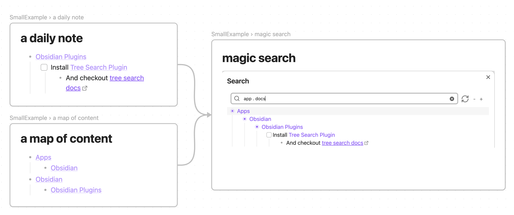

# Obsidian TreeSearch Plugin

This is a plugin for Obsidian to help navigate a hierarchy of notes and connections that are built as you type.
No special annotation, just record relations whenever you want them.

And much more! Checkout docs: https://catacgc.github.io/tree-search-docs
