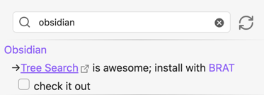
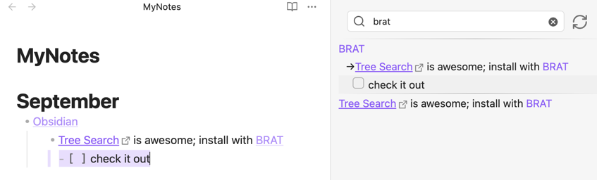
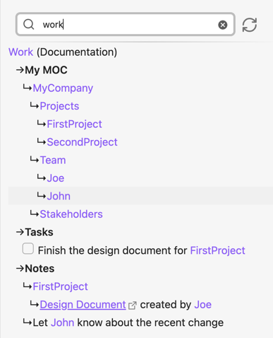
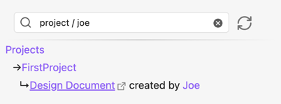

# Obsidian TreeSearch Plugin

Obsidian is good at linking notes together. What this plugin does is to add another layer to the linking
capabilities of Obsidian, namely hierarchical linking.

## Installing

- Install BRAT plugin from the Obsidian Community Plugins
- With Brat, install the TreeSearch plugin by adding a beta plugin with the following URL: https://github.com/catacgc/obsidian-tree-search
- Make sure you have Dataview installed

## Usage

### Simple Example

The idea is that you can link notes together in a hierarchy where the hierarchy is made up of nodes in the note.

Here's a simple example (try to reproduce in your vault). You have daily/weekly notes where you jolt down your references and notes through the day.

In `MyNotes.md` you have the following:

```markdown
# September

- [[Obsidian]]
	- [Tree Search](https://github.com/catacgc/obsidian-tree-search) is awesome; install with [[BRAT]]
		- [ ] check it out 
```

Consider for a moment what can be derived from this simple note.
- Obsidian is a parent of `Tree Search`
- BRAT is referenced when mentioning `Tree Search`
- MyNotes#September is a parent of `Obsidian`
- `- [ ] check it out` is a task under `Tree Search`

Obsidian falls short in helping you visualize and search these relations. This is where TreeSearch comes in.

### Searching

The plugin creates a directed graph for all these elements and adds a new command `TreeSearch: Search` that opens a new pane with a search bar.

You can search for a note and see all the notes (and links) that are nested under it.

With our example, search for `obsidian`, and you will see the following: 



Clicking on any result item will highlight the note where the relation was recorded. Clicking on the note or a web link will open it.



Going beyond this trivial example, you can imagine how powerful this can be for a large vault. 
If you spend a minimal amount of time to create some MOC (Maps of Content) you can easily navigate and retrieve items in your vault.

## Advanced Example

Let's create a note to exemplify the full set of features of the plugin: 'Work.md'
Add an alias to this note: `Documentation`

```markdown
# My MOC
- [[MyCompany]]
	- [[Projects]]
	- [[Team]]
	- [[Stakeholders]]

- [[Projects]]
	- [[FirstProject]]
	- [[SecondProject]]

- [[Team]]
	- [[Joe]]
	- [[John]]
# Tasks
- [ ] Finish the design document for [[FirstProject]]

# Notes
- [[FirstProject]]
	- [Design Document](http://link) created by [[Joe]]

- Let [[John]] know about the recent change
```

### MOC (maps of content)

A very useful feature of the plugin is the ability to create a map of content and search them. Search Work or Documentation to see it in action.




### Nested search

You can use the `/` separator (configurable in settings) between keywords to match sub-trees. For example `projects / joe` will show all projects
where Joe was mentioned: 



## How it works

This plugin adds another layer to this Obsidian's linking system, namely hierarchical linking of List Nodes & Pages in the vault.

### Graph Nodes

Even if the plugin is called TreeSearch, the underlying data structure is a directed graph.

Nodes tracked by this plugin are:
- All vault notes
- List items that
	- Have links to other notes
	- Have links to web pages
- All virtual pages (notes that are not in the vault but are linked to)
- Headers (only if they have List items under them)

| Node                                                   | Type         | Description                                                                  |
|--------------------------------------------------------|--------------|------------------------------------------------------------------------------|
| `MyCompany.md`                                         | Page         | A note in the vault                                                          |
| `[[Projects]]`                                         | Virtual Page | Whenever the page does not exist in the vault, but there's still a reference |
| `- [Design Document](http://link) created by [[Joe]]`  | List Item    | All vault lines that contain a Web or a Vault reference                      |
| `## Header`                                            | Header       | A header in a note, if it has List Item children                             |
| `- [ ] Task`                                           | Task         | A task in a note                                                             |

### Directed Edges

The plugin track relations between nodes. The relation have the direction implied by the outline:
- If a Page is under another Page, the first is a child of the second
- If a List Item is under another List Item, the first is a child of the second
- If a List Item is under a Header, the first is a child of the Header
- If a List Item is under a Page, the first is a child of the Page
- If a List Item contains multiple references to other Pages, all Pages are parents of the List Item
- Tasks are treated identical to List Items

## Features

- No setup, just install and use
- Add relations as they happen, no special annotation needed
- Powerful and very (for a thousand-sized vault) graph search
- Nested search ( parent / children )
- Exclude relations via tagging (e.g. #archive)
- Web pages as first class citizens in the graph
- Support page aliases
- Live update of the graph as you type
- Search results point back to where the relation was recorded


## Found this useful?

- Open some issues if you have suggestions or found a bug
- Share to others if you think they might find it useful
- [Buy me a coffee if you really like it](https://github.com/sponsors/catacgc/button). Otherwise, buy the dataview folks a coffe, as I am using their plugin to build mine :)
