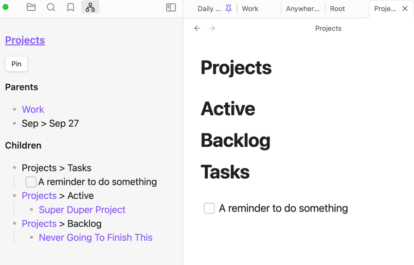

# File Context

You can assign a key or use the command panel top open the File Context.
It shows all the current partents and children at depth for the current file.

The Pin button allows you to keep the context unchanged while you navigate the vault 
(useful for organizing notes).

Of course, the graph of children and parents is built across the vault.
And you can navigate to any note by clicking on it which will highlight
where the relation was recorded.
