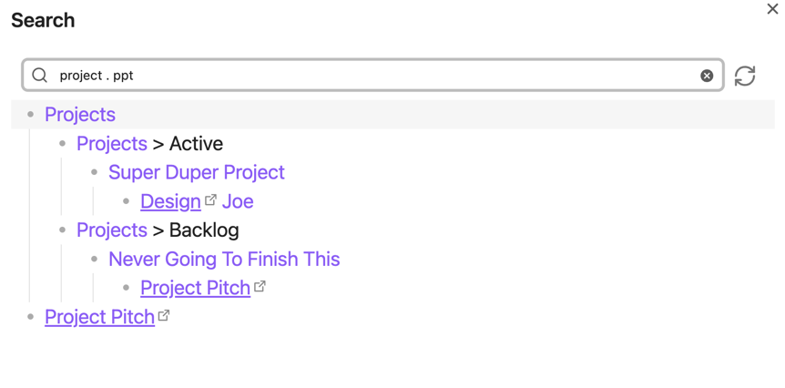
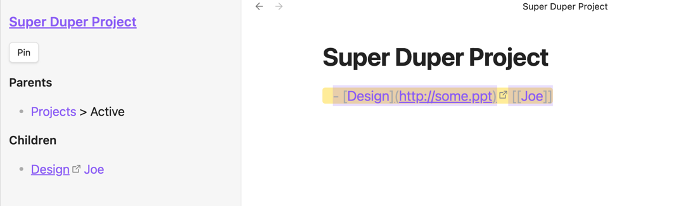

# Searching

Search is the must powerful feature of this plugin. You can open a modal (Search Modal)
or a pane (Search) to search for a note and see all the notes (and links) that are nested under it.

This makes retrieval of atoms of information (notes, tasks, tags, headers, and web links) very easy.

Say that you search from a presentation at work. With a semi-structured vault,
you can start your search from "project" and use the search separator (. configured in settings) 
to search for "ppt".

The surrounding notes are also shown to give you context. 
You can now narrow further to a specific project.

Now that you have the presentation, there are three commands available:

- Enter -> open and highlight the line where that relation was recorded: 

- Cmd/Ctrl + Enter -> open and **select** the line. This is useful for quickly moving atoms around.

- Shift + Enter -> open the first link or web link in the note. This effectively
makes the plugin a launcher for your notes and bookmarks.
