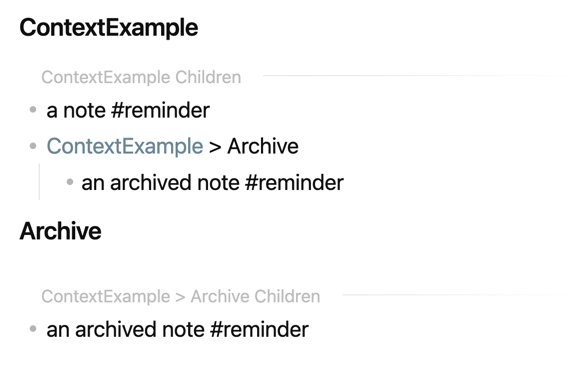

# Tree Context

You can use the `tree-context` macro to show a map of content in a note.

## Usage

    ```tree-context
    file: "[[Root]]"    # Optional, the current file / header is inferred; use quotes
    depth: 2            # Optional, default is 2
    ```


For a file with the following content:

    <!-- ContextExample.md -->

    ```tree-context
    depth: 2
    ```
    <!-- auto detects the file -->
        
    # Archive

    ```tree-context
    depth: 2
    ```
    <!-- auto detects the archive header -->


And the following files links anywhere in the vault:

    - [[ContextExample]]
        - a note #reminder

    - [[ContextExample#Archive]]
        - an archived note #reminder

The output in the file will be:

